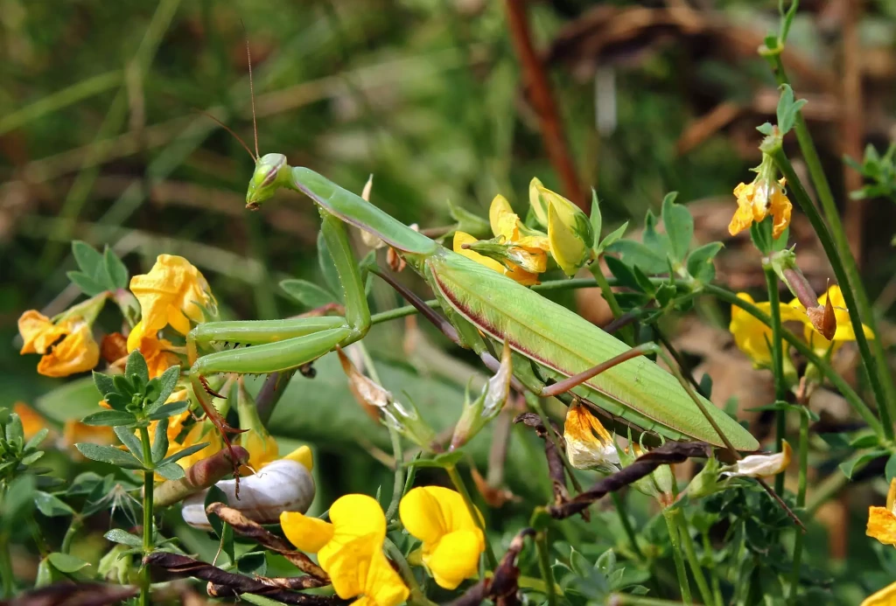

# 🦗 Gottesanbeterin Gesucht (Mantis Tracker)



Mantis Tracker is a Flask web application for collecting, reviewing, and
publishing sightings of the European mantis (*Mantis religiosa*).

Project website: [gottesanbeterin-gesucht.de](https://gottesanbeterin-gesucht.de/)

## Features

- Public multi-step report form (`/melden`)
- Reviewer workflow for quality control (`/reviewer`)
- Public map and statistics for accepted reports (`/auswertungen`, `/statistik`)
- Image upload pipeline with WebP storage
- PostgreSQL full-text search and export tools for reviewers

## Quick Start (Container)

Prerequisites:

- [Podman](https://podman.io/docs/installation) or [Docker](https://docs.docker.com/get-started/get-docker/) with [Compose](https://docs.docker.com/compose/install/)
- [`just`](https://github.com/casey/just#installation)

```bash
cp .env.example .env
# Set a secure SECRET_KEY, e.g.:
# python -c "import secrets; print(secrets.token_hex(32))"

just up --build
```

App URL: `http://localhost:5000`

Useful commands:

```bash
just down
just logs
just shell
just db
just migrate
just seed
just prod --build
just prod-down
```

## Local Development (No Container)

Prerequisites:

- Python 3.13+
- `uv`
- `bun`
- PostgreSQL 16+

```bash
cp .env.example .env
uv sync --extra dev
bun install
```

Create databases:

```sql
CREATE USER mantis_user WITH PASSWORD 'mantis' CREATEDB;
CREATE DATABASE mantis_tracker OWNER mantis_user;
```

Run migrations and seed base data:

```bash
uv run flask db upgrade
uv run flask create_all_data_view
uv run flask seed
# optional demo data:
uv run flask seed --demo
```

Start app:

```bash
uv run python run.py
```

`run.py` starts Flask and the frontend watcher (`bun run watch`).

Reviewer quick login (local dev): `http://localhost:5000/reviewer/9999`

## Architecture (Short)

```text
Browser
  |
  v
Flask App (Blueprints)
  |         \
  v          v
PostgreSQL   app/datastore (WebP)
  ^
  |
Vite Build (app/static/build + manifest)
```

Core areas:

- `app/routes/`: HTTP endpoints (`main`, `report`, `data`, `statistics`, `provider`, `admin`, `regionen`)
- `app/database/`: SQLAlchemy models, materialized view, seed/populate logic
- `app/tools/`: domain utilities (coordinates, MTB, mail, Vite helpers)
- `migrations/`: Alembic migrations

## Quality and Tests

```bash
uv run ruff check .
uv run pyright
uv run pytest
uv run pytest -m unit
uv run pytest --cov=app --cov-report=term-missing
```

Tests use a separate PostgreSQL database: `mantis_tester`.

## Documentation

Build docs:

```bash
uv sync --extra docs
make -C docs html
```

Strict docs check:

```bash
uv run sphinx-build -W --keep-going -b html docs /tmp/mantis-docs-build
```

Main docs entry points:

- `docs/index.rst`
- `docs/userinterface/index.rst`
- `docs/develop/index.rst`

## Project Structure

```text
mantis/
├── app/
│   ├── routes/
│   ├── database/
│   ├── templates/
│   ├── static/
│   └── tools/
├── docs/
├── infrastructure/
├── migrations/
└── tests/
```

## License

MIT, see `LICENCE.md`.
