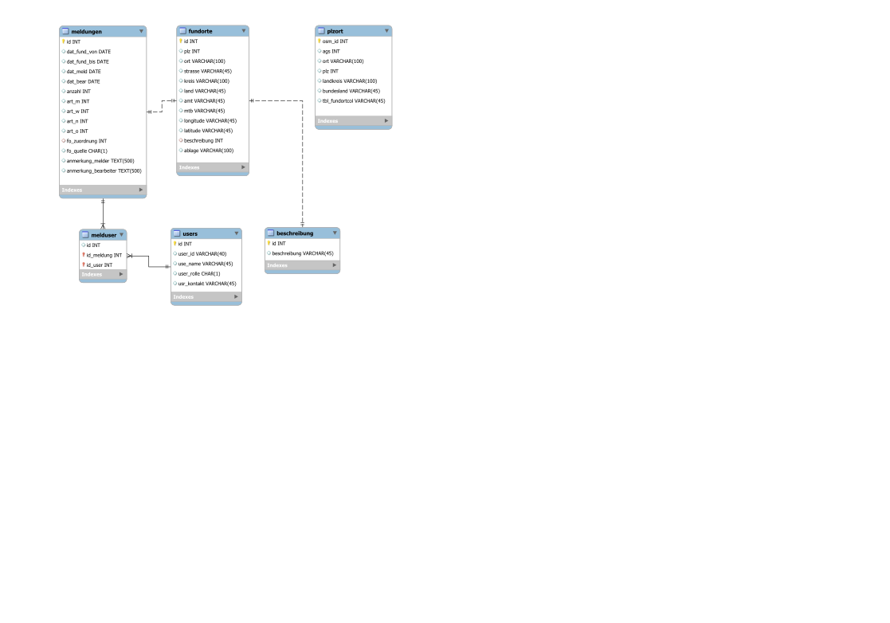

Datenbank und Migrationen
=========================

Schema
------

Wichtige Orte im Repository
---------------------------

- Modelle und DB-Logik: ``app/database/``
- Migrationen: ``migrations/``
- Konfiguration (DB-URI aus Umgebungsvariablen): ``app/config.py``
- optionale Demo-Daten: ``app/demodata/``

Kernobjekte
-----------

.. list-table::
   :header-rows: 1

   * - Tabelle / Modell
     - Zweck
     - Beziehungen
   * - ``meldungen`` / ``TblMeldungen``
     - fachliche Meldung
     - n:1 zu ``fundorte``; 1:1 zu ``melduser``
   * - ``fundorte`` / ``TblFundorte``
     - Ortsdaten inkl. Bildpfad ``ablage``
     - 1:n von ``meldungen``
   * - ``users`` / ``TblUsers``
     - Melder, Finder, Reviewer
     - 1:n über ``melduser``
   * - ``melduser`` / ``TblMeldungUser``
     - Verknüpfung Meldung zu Melder/Finder
     - FK zu ``meldungen`` und ``users``
   * - ``beschreibung`` / ``TblFundortBeschreibung``
     - Katalog Fundortbeschreibung
     - 1:n zu ``fundorte``
   * - ``user_feedback`` / ``TblUserFeedback``
     - Herkunft der Meldung pro User
     - 1:1 zu ``users``

Status- und Suchmodell
----------------------

- ``meldungen.statuses`` ist ein String-Array mit den Werten aus ``ReportStatus``.
- Workflowzustand ist ``OPEN`` oder ``APPR`` oder ``DEL``.
- ``INFO`` und ``UNKL`` sind Zusatzflags.
- Volltextsuche läuft über ``meldungen.search_vector`` mit GIN-Index.

Materialized View
-----------------

- Name: ``all_data_view``
- Modell: ``TblAllData``
- Aufbau: Join aus ``meldungen``, ``fundorte``, ``beschreibung``, ``melduser``, ``users``
- Verwendung: Admin- und Superuser-Ansichten
- Funktionen: ``create_materialized_view`` und ``refresh_materialized_view``

Regelworkflow bei Schemaänderungen
----------------------------------

.. code-block:: bash

   uv run flask db migrate -m "kurze beschreibung"
   uv run flask db upgrade

Materialized View und Seed-Daten
--------------------------------

.. code-block:: bash

   uv run flask create_all_data_view
   uv run flask seed
   # optional:
   uv run flask seed --demo

Migrationshistorie
------------------

Migrationen liegen in ``migrations/versions`` und enthalten u. a.:

- initiales Schema
- Einführung des Statusarrays
- Performance-Indizes
- native FTS-Suchvektoren und Trigger
- Constraints für eindeutige Benutzer-/Approver-Bezüge

Lokale Neuinitialisierung (optional)
------------------------------------

Nur für lokale Entwicklungsumgebungen:

.. code-block:: sql

   DROP DATABASE IF EXISTS mantis_tracker;
   DROP DATABASE IF EXISTS mantis_tester;
   CREATE DATABASE mantis_tracker OWNER mantis_user;
   CREATE DATABASE mantis_tester OWNER mantis_user;

.. code-block:: bash

   uv run flask db upgrade
   uv run flask create_all_data_view
   uv run flask seed
