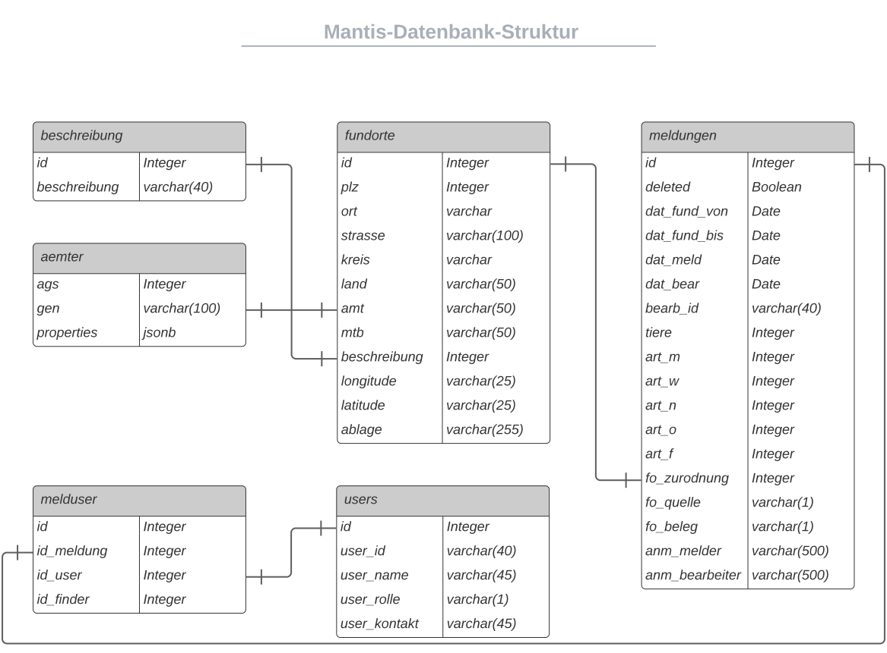

🗃️ Databank
===========

Schema
------
.. index:: Datanbank; Schema
.. index:: Schema; Datenbank
	   

- Die mit Alembic erstellten Relationen finden Sie im Repository im
  Ordner

  ``manits/app/database/``.
- Die Verbindung zur Datenbank wird in der Datei

  ``manits/app/config.py``

  definiert. 

Demodaten
---------
.. index:: Datenbank; Demodaten
.. index:: Demodaten; Datenbank
	   
Demodaten befinden sich im Ornder:

  ``manits/tests/demaodata``

Neuanlage
---------

Die Schritten für eine Neuanlage der Datenbank und der Inport der
Demodaten:

1. In der Datenbank

   ::

      \c postgres
      drop database mantis_tracker;
      create database mantis_tracker;

2. In der virutellen Umgebung (env)

   ::

      rm -rf migrations
      flask db init
      flask db migrate -m "Initialisierung"
      flask db upgrade
      
3. Einlesen der Demodaten

   Die dort genannten Schritte nacheinander ausführen.
   
   Siehe ``manits/tests/demaodata/demo-data-main.sql``
