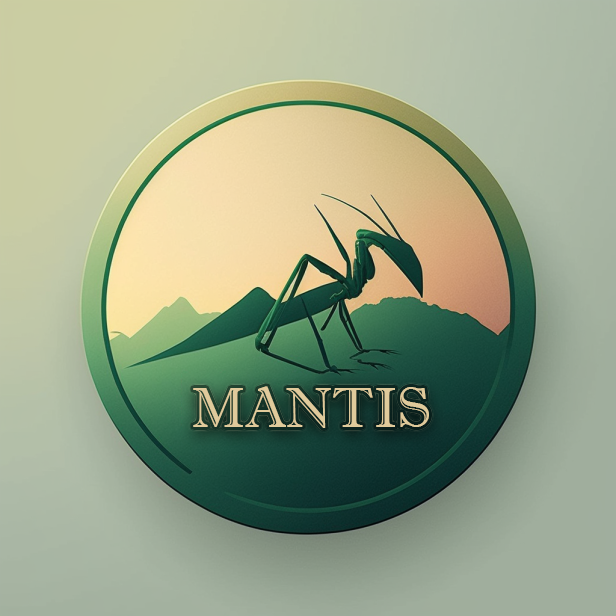

Mantis's Projekt
================

.. sidebar:: 

   * :ref:`genindex`
   * :ref:`search`
   * `Quellcode -- GitLab <https://gitlab.com/opendata-apps/mantis>`_
   
Im Jahr 2017 initierten das Naturkundemuseum Potsdam und die Mantifreunde
Berlin-Brandenburg das Mitmachprojekt »Gottesanbeterin gesucht!«.

Machen Sie mit und werden Sie zum Insektenforscher.

Sie finden hier die Dokumentation zum Projekt. Die wichtigsten Todo's
werden in einm Backlog verwaltet.

🌟 Funktionen
-------------
    - 📚 Erfahren Sie mehr über die Gottesanbeterin
    - 🎨 Schöne Benutzeroberfläche
    - 📝 Melden Sie Gottesanbeterin-Sichtungen mit einem benutzerfreundlichen Formular
    - 🗺️ Sehen Sie alle Gottesanbeterin-Sichtungen auf einer interaktiven Karte
    - 📊 Betrachten Sie aufschlussreiche Statistiken und FAQs
.. toctree::
   :maxdepth: 1
   :caption: Inhalte:

   insekt/steckbrief
   develop/index

