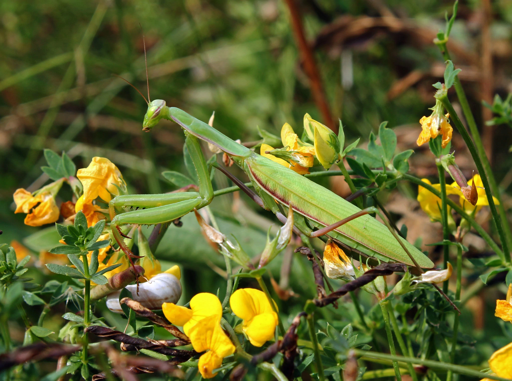

Mantis Projekt
==============

Das Projekt ``Gottesanbeterin gesucht!`` erfasst Meldungen zu Sichtungen
von *Mantis religiosa* und stellt sie auf Karte, in Auswertungen und im
Reviewer-Workflow bereit.

Inhalte:

- Fachinhalt zur Art
- Bedienung der Oberfläche
- technische Doku für Entwicklung und Betrieb

.. toctree::
   :maxdepth: 2
   :caption: Inhalte

   insekt/steckbrief
   userinterface/index
   develop/index

Projektlinks
------------

- `Projektwebseite <https://gottesanbeterin-gesucht.de/>`_
- `Quellcode (GitLab) <https://gitlab.com/opendata-apps/mantis>`_
- :ref:`genindex`
- :ref:`search`
