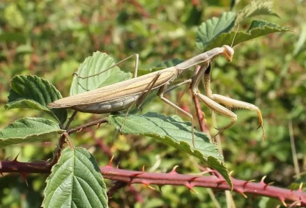

=============================
 Infos zur »Gottesanbeterin«
=============================

.. INDEX:: Gattesanbeterein; lateinischer Name
.. INDEX:: lateinischer Name; Gattesanbeterein

Karl von Linné taufte das Insekt 1758 auf den Namen *Mantis
religiosa*. Die *Mantis religiosa* gehört zu den Fangschrecken
(Nontodea), von denen weltweit bisher etwa 2400 Arten beschrieben
sind.

.. INDEX:: Ausbreitung; Gottesanbeterin
.. INDEX:: Gottesanbeterin; Ausbreitung

Ausbreitung
===========

In Süderuopa ist die Europäische Gottesanbeterin häufig anzutreffen,
wohingegen sie in Deutschland immer selten war. Historische Nachweise
in Deutschland gibt es aus Frankfurt am Main, Bad Dürkheim und um
Passau. Bekannt ist das Vorkommen am Kaiserstuhl. Kleine lokale
Vorkommen überlebten in Rheinland-Pfalz, Baden Würtemberg und dem
Saarland, von wo aus sich die Lauerjägerin seit Mitte der 1990er Jahre
nordwärts ausbreitet.

Seit der Jahrtausendwende wandert die Fangschrecke auch aus dem
Südosten Europas in die neuen Bundesländer ein. Hier kam sie früher
nicht vor. So wurde die Art erstmalig 2003 bei Leipzig in Sachsen 
sowie im Jahr 2006 in einem Tagebau der Oberlausitz und am
Geiseltalsee in Sachsen-Anhalt gefunden.

In Brandenburg wurde die Südländerin zum ersten Mal 2007
gesichtet. Bis 2016 kamen Nachweise aus den Brandenburger Landkreisen
Spreee-Neiße, Oberspreewald-Lausitz, Elbe-Elster, Dahme-Spreewald und
Havelland hinzu. Auch in Berlin gibt es zwei Vorkommen.

Erfassung
=========

Sie können sich zukünftig an der Erfassung der Sichtungen beteiligen:

mantis.methopedia.eu (aktuell noch ein Prototyp)

Bis zum regulären Einsatz nutzen Sie bitte den klassischen Weg der E-Mail.

https://www.naturkundemuseum-potsdam.de/gottesanbeterin-gesucht
