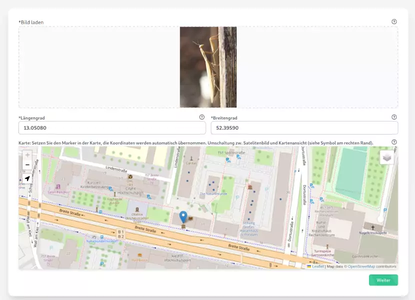
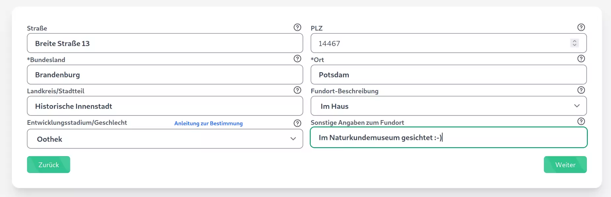
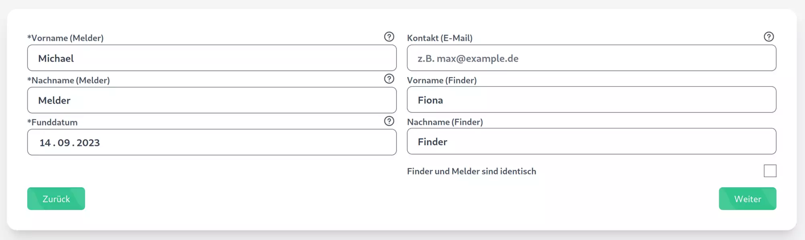
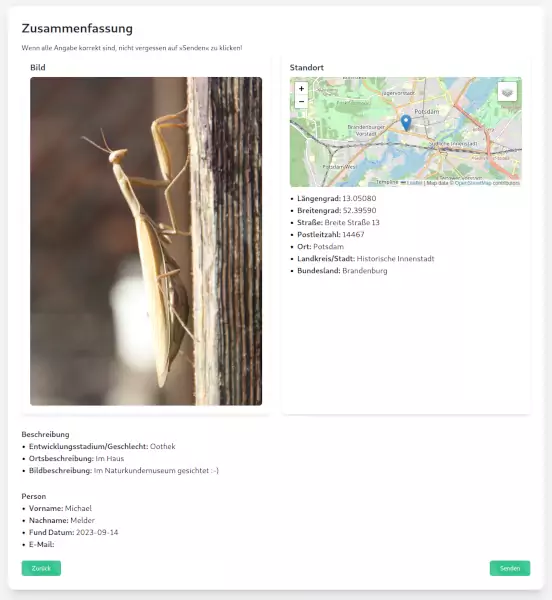

=========================
 Melder und Sichtung(en)
=========================

Der Melder kann in vier Schritten eine Sichtung hinzufügen.

Erster Schritt
==============

- Auswahl eines Fotos, das den Körper und die Fühler gut sichtbar abbildet.
- Auswahl des Fundortes auf der Karte durch Setzen eines Markers.

Zweiter Schritt
===============

- Kontrolle/Ergänzung der automatisch ermittelten Daten.
- Festlegen des Entwicklunsstadiums/des Geschlechts
  (siehe Link zur Bestimmung).
  Dieser Schritt ist optional. 
- Sollte die Auswahl für die Fundortbeschreibung nicht reichen, kann
  im nächsten Feld ergänzt werden.

Dritter Schritt
===============

- Kontaktdaten für eventuelle Rückfragen.
- Eventuell die Unterscheidung zwischen Melder und Finder.
- Festlegen des Datums der Sichtung.

  
Vierte Schritt
==============

- Eine Zusammenfassung wird gezeigt, die eine Kontrolle ermöglicht und
  im Zweifelsfall über den Zurück-Button eine Korrektur erlaubt.
- Mit dem Klick auf »Senden« werden die Daten endgültig übertragen.
- Eine kleine Nachrichtenbox zeigt die erfolgreiche Speicherung an.

  
  
  
