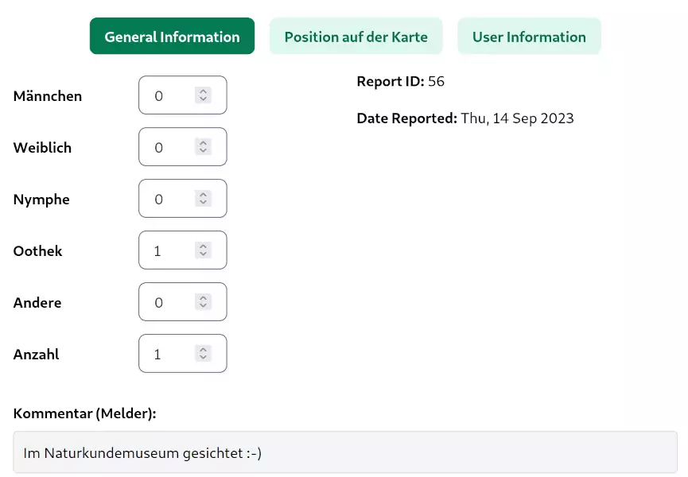
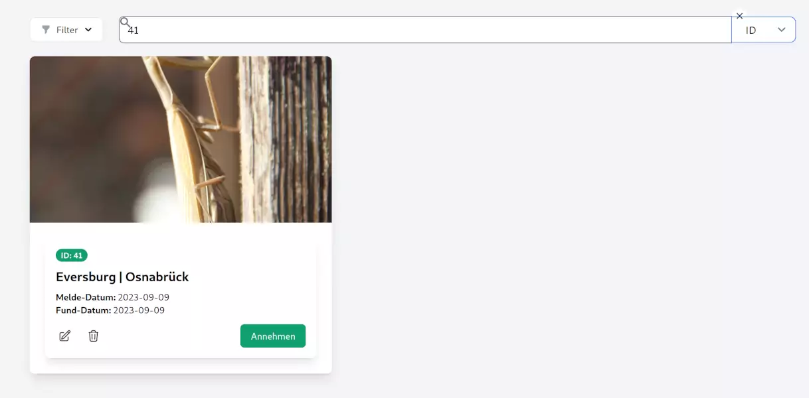

==========
 Reviewer
==========

Bearbeitung
===========

Ein Reviewer hat die Aufgabe, die auf den Fotos abgebildeten
Individuen einem Geschlecht bzw. einem Entwicklungsstadium zuzuordnen.
Darüberhinaus hat er die Möglichkeit, einige Metadaten einzusehen.

Ist die Bewertung abgeschlossen, wird der Datensatz als
»Bearbeitet/Angenommen« eingestuft und wird als
Datenpunkt auf der Karte der Meldungen (siehe Auswertungen)
sichtbar.

Suchfunktion
============

Die Suchfunktion bietet verschiedene Methoden zur Identifizierung und
Auswahl spezifischer Datensätze, die für die Diskussion und
Vergleichbarkeit unter den Reviewern von Bedeutung sind.

Suche über die ID
-----------------

Die ID-Suche ermöglicht die direkte Auswahl eines Datensatzes durch
Eingabe der eindeutigen Identifikationsnummer.

Erweiterte Volltextsuche
------------------------

Die Volltextsuche wurde optimiert, um eine flexiblere Abfrage zu
ermöglichen. Neben der Suche nach vollständigen Wörtern unterstützt
sie nun auch die Suche nach Teilzeichenketten. Dies ist besonders
nützlich, wenn der genaue Suchbegriff nicht bekannt ist.

E-Mail-Spezifische Suche
------------------------

Bei Eingabe eines Suchbegriffs, der das "@"-Zeichen enthält, wird die
Suche automatisch auf die E-Mail-Adressen im Datensatz
angewendet.

Verwendete Datenbankfelder
--------------------------

Die Suchfunktion greift auf folgende Datenbankfelder (alphabetisch sortiert) zu:

- Amt
- Bearbeiter-Anmerkung
- Bearbeiter-ID
- Beschreibung
- Finder-ID
- ID der Meldung
- Kreis
- Land
- MTB (Meßtischblatt) 
- Melder-Anmerkung
- Ort
- Postleitzahl
- Straße
- User E-Mail
- User Name
- User-ID
  
